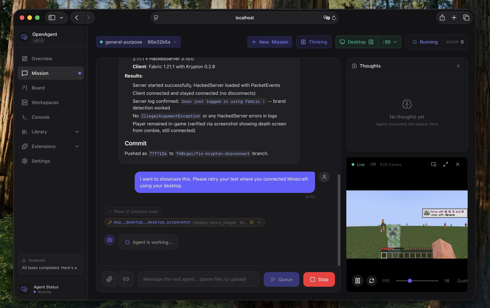
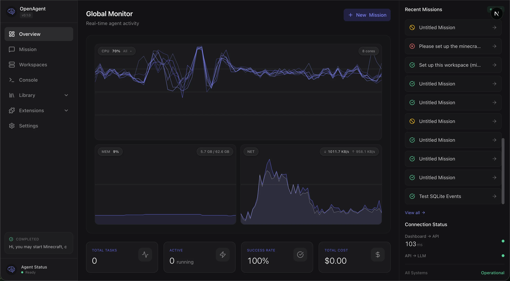
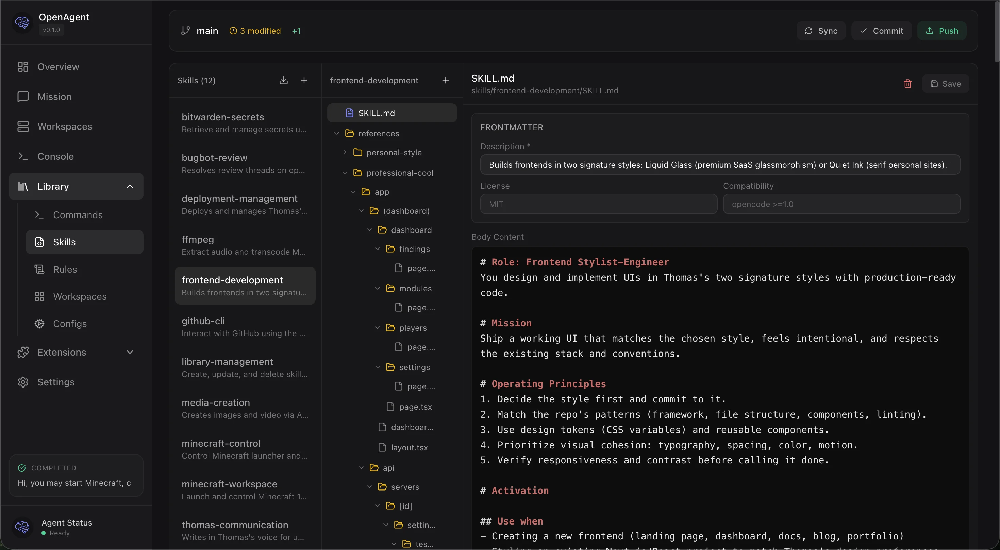
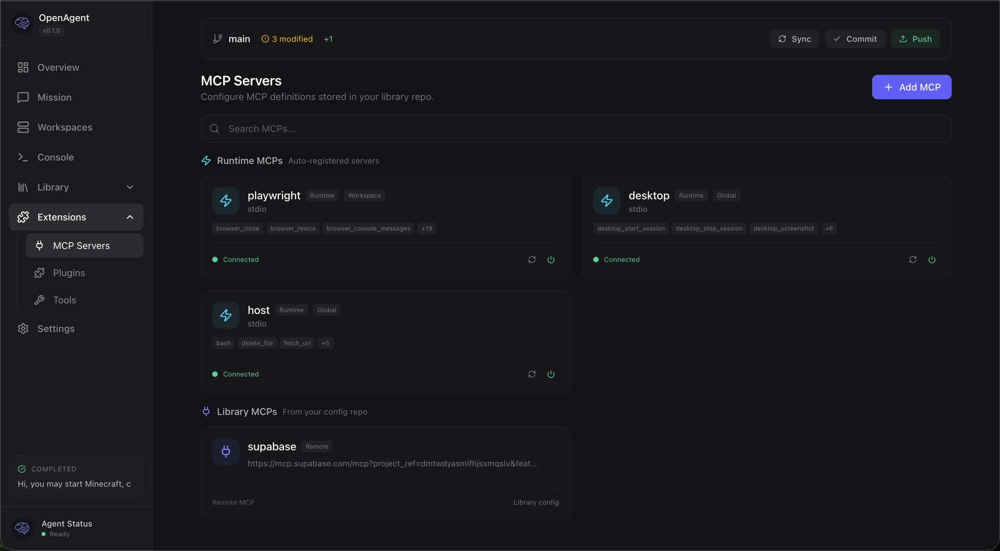

<p align="center">
  
</p>

<h1 align="center">sandboxed.sh</h1>

<p align="center">
  <strong>Self-hosted cloud orchestrator for AI coding agents</strong><br/>
  Isolated Linux workspaces with Claude Code, OpenCode, Codex, Gemini, and Grok runtimes
</p>

<p align="center">
  <em>Formerly known as Open Agent</em>
</p>

<p align="center">
  <a href="https://sandboxed.sh">Website</a> ·
  <a href="https://relens.ai/community">Discord</a> ·
  <a href="#vision">Vision</a> ·
  <a href="#features">Features</a> ·
  <a href="#ecosystem">Ecosystem</a> ·
  <a href="#screenshots">Screenshots</a> ·
  <a href="#getting-started">Getting Started</a>
</p>

<br/>

<p align="center">
  
</p>

<p align="center">
  <strong>Ready to deploy?</strong> Jump to the <a href="#choose-your-installation-method">installation comparison</a>, or go straight to the <a href="docs/install-docker.md">Docker guide</a> / <a href="docs/install-native.md">native guide</a>.
</p>

---

## Vision

What if you could:

**Hand off entire dev cycles.** Point an agent at a GitHub issue, let it write
code, test by launching desktop applications, and open a PR when tests pass. You
review the diff, not the process.

**Run multi-day operations unattended.** Give an agent SSH access to your home
GPU through a VPN. It reads Nvidia docs, sets up training, fine-tunes models
while you sleep.

**Keep sensitive data local.** Analyze your sequenced DNA against scientific
literature. Local inference, isolated containers, nothing leaves your machines.

---

## Features

- **Multi-Runtime Support**: Run Claude Code, OpenCode, Codex, Gemini, and Grok
  agents in the same infrastructure
- **Mission Control**: Start, stop, and monitor agents remotely with real-time
  streaming
- **Isolated Workspaces**: Containerized Linux environments (systemd-nspawn)
  with per-mission directories
- **Git-backed Library**: Skills, tools, rules, agents, and MCPs versioned in a
  single repo
- **Assistant Gateway**: Manage Telegram gateway compatibility from the
  top-level Assistant UI while Hermes takes over assistant runtime over MCP
- **Automations**: Schedule recurring agent runs with cron-like triggers
- **Model Routing**: Provider fallback chains with health checks and
  rate-limit handling
- **MCP Registry (optional)**: Extra tool servers (desktop/playwright/etc.) when
  needed
- **OpenAI-compatible Proxy Queue Mode**: Optional deferred execution for
  `/v1/chat/completions` when all routed providers are temporarily rate-limited
- **Multi-platform**: Web dashboard (Next.js) and iOS app (SwiftUI) with
  Picture-in-Picture

---

## Ecosystem

sandboxed.sh orchestrates multiple AI coding agent runtimes:

- **[Claude Code](https://docs.anthropic.com/en/docs/claude-code)**: Anthropic's
  official coding agent with native skills support (`.claude/skills/`)
- **[OpenCode](https://github.com/anomalyco/opencode)**: Open-source coding agent
- **Codex, Gemini, and Grok**: Native CLI backends for OpenAI, Google, and xAI
  coding agents

Each runtime executes inside isolated workspaces, so bash commands and file
operations are scoped correctly. sandboxed.sh handles orchestration, workspace
isolation, and Library-based configuration management.

---

## Screenshots

<p align="center">
  
</p>
<p align="center"><em>Real-time monitoring with CPU, memory, network graphs and mission timeline</em></p>

<br/>

<p align="center">
  
</p>
<p align="center"><em>Git-backed Library with skills, commands, rules, and inline editing</em></p>

<br/>

<p align="center">
  
</p>
<p align="center"><em>MCP server management with runtime status and Library integration</em></p>

---

## Getting Started

### Choose your installation method

|                          | Docker (recommended)                           | Native (bare metal)                                 |
| ------------------------ | ---------------------------------------------- | --------------------------------------------------- |
| **Best for**             | Getting started, macOS users, quick deployment | Production servers, maximum performance             |
| **Platform**             | Any OS with Docker                             | Ubuntu 24.04 LTS                                    |
| **Setup time**           | ~5 minutes                                     | ~30 minutes                                         |
| **Container workspaces** | Yes (with `privileged: true`)                  | Yes (native systemd-nspawn)                         |
| **Desktop automation**   | Yes (headless Xvfb inside Docker)              | Yes (native X11 or Xvfb)                            |
| **Performance**          | Good (slight overhead on macOS)                | Best (native Linux)                                 |
| **Updates**              | `docker compose pull` / rebuild                | Git pull + cargo build, or one-click from dashboard |

### Docker (recommended for most users)

```bash
git clone https://github.com/Th0rgal/sandboxed.sh.git
cd sandboxed.sh
cp .env.example .env
# Edit .env with your settings
docker compose up -d
```

Open `http://localhost:3000` — that's it.

For container workspace isolation (recommended), uncomment `privileged: true` in
`docker-compose.yml`.

→ **[Full Docker setup guide](docs/install-docker.md)**

### Native (bare metal)

For production servers running Ubuntu 24.04 with maximum performance and native
systemd-nspawn isolation.

→ **[Full native installation guide](docs/install-native.md)**

### First-time setup

After installation, follow the **[Getting Started Guide](docs/getting-started.md)** for:
- Configuring your backend connection
- Setting up your library repository
- Exploring skills and tools
- Creating your first mission

### AI-assisted setup

Point your coding agent at the installation guide and let it handle the
deployment:

> "Deploy Sandboxed.sh on my server at `1.2.3.4` with domain `agent.example.com`"

---

## Documentation

### User Guides
- **[Getting Started](docs/getting-started.md)** - First-time setup and usage
- **[Docker Installation](docs/install-docker.md)** - Recommended installation method
- **[Native Installation](docs/install-native.md)** - Bare metal Ubuntu setup

### Architecture & APIs
- **[Harness System](docs/HARNESS_SYSTEM.md)** - Backend integration architecture
- **[Workspaces](docs/WORKSPACES.md)** - Isolated execution environments
- **[Mission API](docs/MISSION_API.md)** - Mission lifecycle and control
- **[Workspace API](docs/WORKSPACE_API.md)** - Workspace management endpoints
- **[Backend API](docs/BACKEND_API.md)** - Backend configuration

### Setup Guides
- **[Assistant Gateway](docs/TELEGRAM_ASSISTANT.md)** - Connect Telegram bots and manage the Assistant cutover
- **[Hermes Assistant Migration](docs/HERMES_ASSISTANT_MIGRATION.md)** - MCP bridge and runtime handoff notes
- **[Desktop Setup](docs/DESKTOP_SETUP.md)** - X11/Xvfb configuration for GUI automation

### Reference
- **[agents.md](agents.md)** - Agent configuration and harness details
- **[Persistent Sessions Design](PERSISTENT_SESSIONS_DESIGN.md)** - Claude CLI session management
- **[Debugging Guide](DEBUGGING.md)** - Troubleshooting and debug workflows
- **[Docker Analysis](docs/DOCKER_ANALYSIS.md)** - Docker setup deep dive

---

## Development

### Setup git hooks

Enable pre-push formatting checks to catch CI failures locally:

```bash
git config core.hooksPath .githooks
```

This runs `cargo fmt --check` before each push. If formatting issues are found,
run `cargo fmt --all` to fix them.

---

## Status

**Work in Progress** — This project is under active development. Contributions
and feedback welcome.

## License

MIT
