# Getting Started with sandboxed.sh

This guide will walk you through setting up and using sandboxed.sh for the first time, from configuring your backend connection to creating your first AI-powered mission.

## What is sandboxed.sh?

sandboxed.sh is a powerful AI agent orchestration platform that manages multiple AI coding assistants (OpenCode, Claude Code, Codex, Gemini, and Grok) through a unified dashboard. It provides:

- **Git-backed configuration library** - Store and version control your skills, agents, commands, and tools
- **Multiple workspace support** - Isolated containers for different projects
- **Config profiles** - Manage different configurations for each AI harness
- **Mission control** - Queue and manage AI tasks with real-time monitoring

## Prerequisites

Before starting, you need:

1. **sandboxed.sh backend** running (locally or remote)
   - Local: `http://localhost:3000` (default)
   - Remote: Your server URL (e.g., `https://agent-backend.example.com`)

2. **Dashboard Access**
   - Web: `http://localhost:3001` (local development)
   - iOS app: Available from the App Store

## Optional: Run Dev Smoke Suites

Before or after backend changes, run the smoke scripts against your dev deployment to quickly validate model routing and harness streaming behavior.

Required environment variables:

```bash
export SANDBOXED_SH_DEV_URL="https://your-dev-backend.example.com"
export SANDBOXED_SH_TOKEN="<control-api-token>"
export SANDBOXED_SH_WORKSPACE_ID="<workspace-uuid>"
export SANDBOXED_PROXY_SECRET="<proxy-bearer-token>"
```

Run the unified smoke gate:

```bash
scripts/smoke_harnesses_dev.sh \
  --backend claudecode \
  --backend opencode \
  --backend codex \
  --model-override opencode=builtin/smart \
  --expect-model opencode=glm-5 \
  --non-streaming
```

Notes:
- Use `--skip-proxy` to run harness streaming smoke only.
- Use `--skip-mission` to run proxy smoke only.
- Use `--help` to see all options.

## Optional: Deferred Queue Mode for Proxy Routing

If you use `/v1/chat/completions` with model-routing chains, you can opt into deferred mode when every provider in the chain is temporarily rate-limited.

Set this request header:

```text
x-sandboxed-defer-on-rate-limit: true
```

Behavior:
- Normal success path: response is still synchronous (`200`).
- All providers exhausted by temporary limits/unavailability: returns `202 Accepted` with `request_id`, `status=queued`, and `next_attempt_at`.
- Background worker retries automatically; no client resubmission needed.

Check status/result:

```bash
curl -H "Authorization: Bearer $SANDBOXED_PROXY_SECRET" \
  "http://localhost:3000/v1/deferred/<request_id>"
```

Cancel queued work:

```bash
curl -X DELETE \
  -H "Authorization: Bearer $SANDBOXED_PROXY_SECRET" \
  "http://localhost:3000/v1/deferred/<request_id>"
```

Note: deferred mode currently supports non-streaming requests (`stream: false`).

## Step 1: Initial Dashboard View

When you first access the sandboxed.sh dashboard, you'll see the global monitor overview:

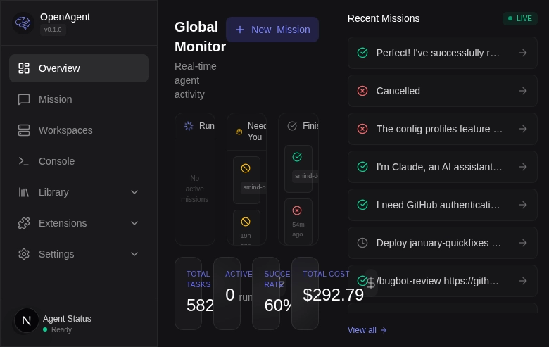

The dashboard shows:
- **Navigation sidebar** - Access different sections (Overview, Mission, Workspaces, Assistant, Library, Settings)
- **Global Monitor** - Real-time view of running missions
- **Recent Missions** - History of completed tasks
- **Agent Status** - Current state (Ready, Busy, etc.)

## Step 2: Configure Backend Connection

### 2.1 Open Settings Menu

Click the **Settings** button in the left sidebar to expand the settings menu:

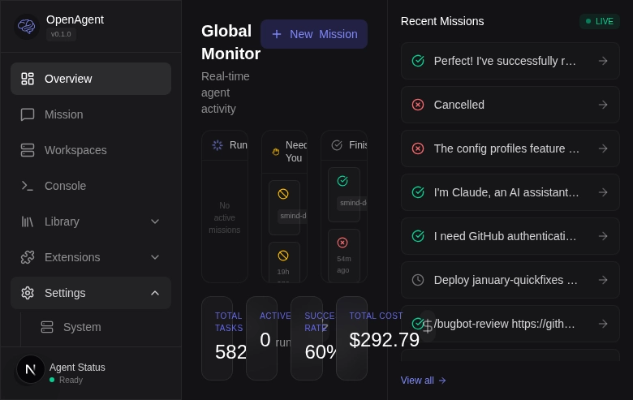

You'll see several settings categories:
- **System** - Server connection and components
- **Backends** - AI harness configurations
- **Providers** - API keys for AI models
- **Data** - Library and backup management
- **Monitoring** - Logging and diagnostics
- **Secrets** - Encrypted credential storage

### 2.2 Access System Settings

Click on **System** to configure your backend connection:

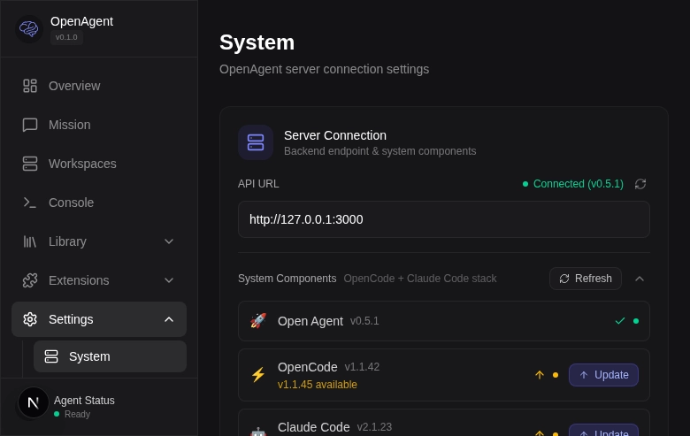

The System page shows:
- **API URL** - Backend endpoint (currently connected status)
- **System Components** - Installed harnesses and versions
  - Sandboxed.sh (current version shown)
  - OpenCode (with update notifications)
  - Claude Code (with update notifications)
  - Codex where installed

### 2.3 Change Backend URL

If you need to connect to a different backend (e.g., a remote server):

1. Click on the **API URL** field
2. Enter your backend URL (e.g., `https://agent-backend-dev.thomas.md`)

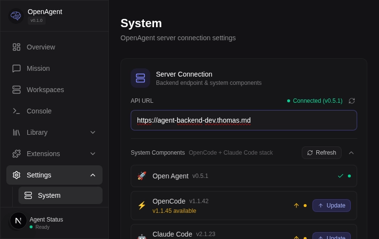

3. Click **Save Changes**

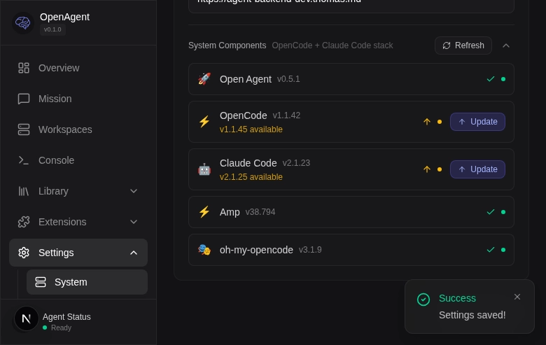

The dashboard will reconnect to the new backend and display a success message.

## Step 3: Configure Your Library

The sandboxed.sh Library is a Git-backed repository that stores all your reusable configurations:

- **Skills** - Specialized knowledge and procedures
- **Agents** - AI assistant configurations
- **Commands** - Quick task templates
- **Tools** - Custom functions and utilities
- **Rules** - Behavioral guidelines
- **MCPs** - Model Context Protocol servers
- **Workspace Templates** - Preconfigured environments

### 3.1 Access Library Settings

1. Click **Settings** > **Data** to access library configuration:

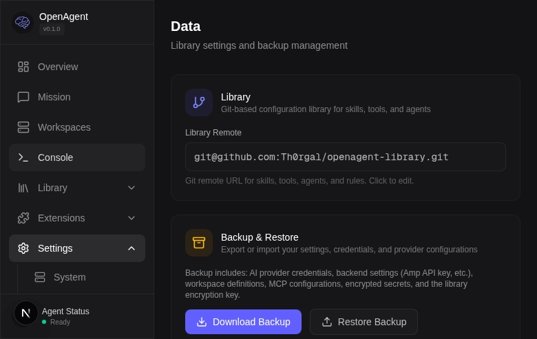

The Data page shows:
- **Library Remote** - Git repository URL (SSH or HTTPS)
- **Backup & Restore** - Export/import your complete configuration

### 3.2 Change Library Repository (Optional)

The default library uses the sandboxed.sh template repository. To use your own:

1. Create a new Git repository (GitHub, GitLab, etc.)
2. Click on the **Library Remote** field:

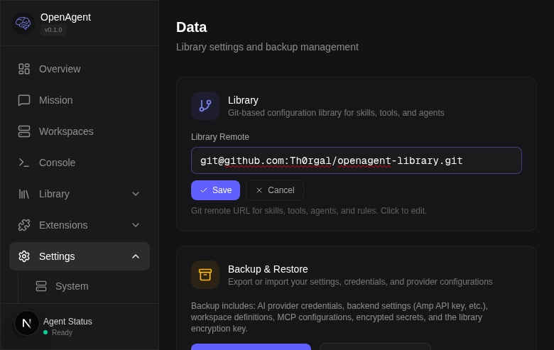

3. Enter your repository URL:
   - SSH: `git@github.com:your-username/your-library.git`
   - HTTPS: `https://github.com/your-username/your-library.git`

4. Click **Save**

**Note**: The backend will clone your repository on first use. If it's empty, consider forking the [sandboxed-library-template](https://github.com/Th0rgal/sandboxed-library-template) as a starting point.

### 3.3 Sync Library

After changing the library remote, click **Sync** in the Library > Configs section to pull the latest changes.

## Step 4: Explore Library Skills

### 4.1 View Installed Skills

Click **Library** > **Skills** to see all available skills:

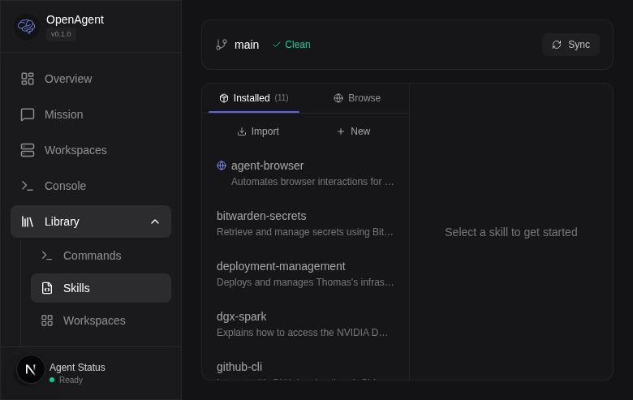

The default library includes several useful skills:
- **agent-browser** - Web automation and testing
- **bitwarden-secrets** - Secure credential management
- **github-cli** - GitHub operations (PRs, issues)
- **library-management** - Library API tools
- **sandboxed.sh-dev** - sandboxed.sh development guide

### 4.2 Edit a Skill

Click on any skill to view and edit its content:

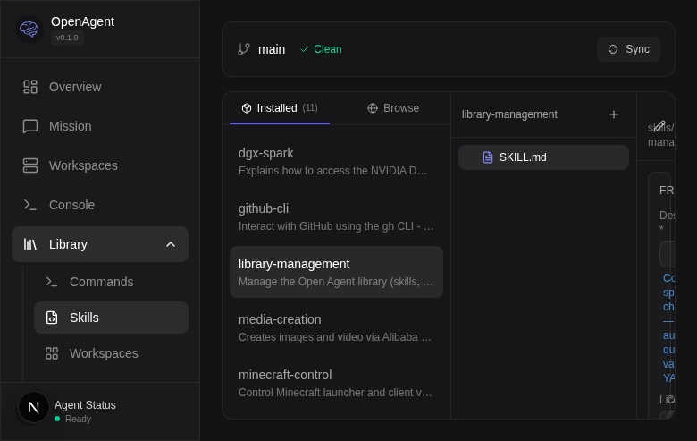

The skill editor shows:
- **Frontmatter** - Metadata (description, license, compatibility)
- **Body Content** - Markdown documentation with instructions
- **Files** - Additional reference files within the skill folder

You can modify the content directly and click **Save** to update the library.

## Step 5: Configure AI Harness Settings

sandboxed.sh supports multiple AI coding harnesses (OpenCode, Claude Code, Codex, Gemini, and Grok). OpenCode, Claude Code, Codex, and sandboxed.sh settings can be managed through configuration profiles.

### 5.1 Access Config Editor

Click **Library** > **Configs** to access the file-based config editor:

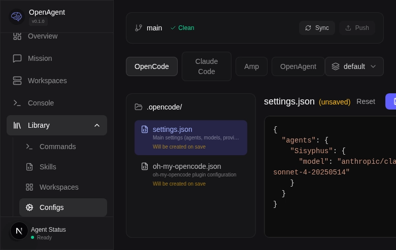

The config editor shows:
- **Harness tabs** - Switch between OpenCode, Claude Code, Codex, and sandboxed.sh settings
- **Profile selector** - Choose or create config profiles (default, custom)
- **Git status** - Branch and sync state
- **File browser** - Navigate config files (`.opencode/`, `.claudecode/`, etc.)
- **JSON editor** - Edit configuration directly

### 5.2 Edit Configuration Files

For OpenCode, you'll typically edit:

1. **opencode.json** - Main configuration:
```json
{
  "agent": {
    "reviewer": {
      "description": "Focused code review",
      "mode": "subagent",
      "model": "anthropic/claude-sonnet-4-20250514"
    }
  }
}
```

After editing, click **Save** to commit changes to the library.

## Step 6: Create Your First Mission

### 6.1 Open Mission Control

Click **Mission** in the sidebar to access the control interface:

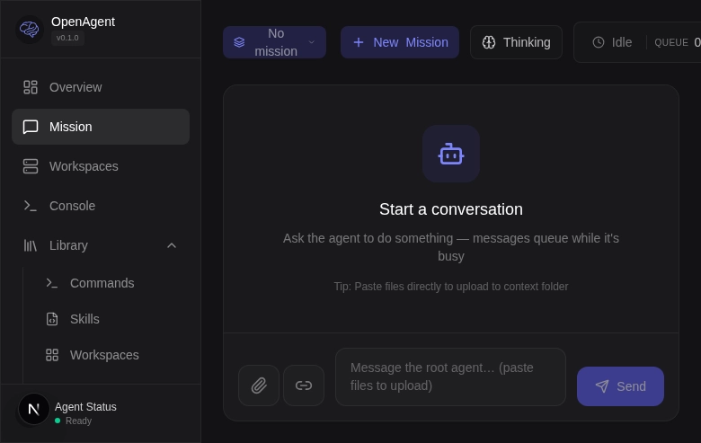

The Mission Control page shows:
- **Mission selector** - Switch between active missions
- **New Mission** - Create a new task
- **Status indicators** - Thinking, Idle, Queue
- **Message area** - Chat interface with the agent

### 6.2 Create a New Mission

Click **+ New Mission** to open the creation dialog:

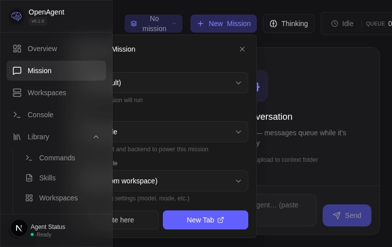

Configure your mission:

1. **Workspace** - Select where the mission runs:
   - **Host (default)** - Direct access to your system
   - **Isolated containers** - Sandboxed environments for projects

2. **Agent** - Choose the AI model:
   - **OpenCode build** - Default implementation agent
   - **OpenCode plan** - Read-only planning agent
   - **Custom agents** - Native agents configured in `.opencode/agents/`

3. **Model Override (optional)** - Force a specific model for this mission:
   - **Claude Code**: use a raw model ID (e.g., `claude-opus-4-7`)
   - **Codex**: use a raw model ID (e.g., `gpt-5.5` or `gpt-5.3-codex`)
   - **Gemini**: use a raw model ID (e.g., `gemini-3.1-pro-preview`)
   - **Grok**: use a raw model ID (e.g., `grok-4.3`)
   - **OpenCode**: use `provider/model` (e.g., `openai/gpt-5.5`)
   - **Model effort**: set effort separately (`low`, `medium`, `high`, `xhigh`) instead of encoding it in the model ID

4. **Config Profile** - Override settings (optional):
   - **Default** - Use workspace configuration
   - **Custom profiles** - Specific model/mode overrides

5. Click **Create here** to start the mission in the current tab, or **New Tab** to open in a new window

### 6.3 Interact with Your Agent

Once created, you can:

- **Send messages** - Type tasks in the message box
- **Upload files** - Drag and drop or paste files directly
- **Monitor progress** - Watch real-time output and thinking process
- **Queue messages** - Send multiple tasks while the agent is busy

Example first message:
```
Please help me understand the structure of this codebase and create a README documenting the main components.
```

## Next Steps

Now that you're set up, explore these features:

### Workspace Management
- Create isolated workspaces for different projects
- Configure workspace templates with pre-installed tools
- Use containers for safe experimentation

### Library Customization
- Create custom skills for your workflows
- Add project-specific commands
- Define reusable tools and functions
- Set up behavioral rules for agents

### Advanced Configuration
- Configure multiple config profiles for different scenarios
- Set up MCP servers for extended functionality
- Create custom agents with specific capabilities
- Configure AI provider API keys securely

### Monitoring and Debugging
- View mission logs and outputs
- Monitor resource usage
- Track agent thinking process
- Review mission history

## Troubleshooting

### Backend Connection Issues

**Problem**: "Failed to connect to backend"

**Solutions**:
1. Verify the backend is running: `curl http://localhost:3000/api/health`
2. Check the API URL in Settings > System
3. Ensure no firewall is blocking the connection
4. For remote backends, verify HTTPS/SSL certificates

### Library Sync Errors

**Problem**: "Failed to sync library"

**Solutions**:
1. Check Git credentials (SSH keys or HTTPS tokens)
2. Verify repository permissions
3. Use `Sync` button to force refresh
4. Check Settings > Data > Library Remote URL

### Mission Creation Fails

**Problem**: "Failed to create mission"

**Solutions**:
1. Verify AI provider API keys (Settings > Providers)
2. Check workspace exists and is accessible
3. Ensure backend has sufficient resources
4. Review backend logs for error details

### Configuration Not Applied

**Problem**: Changes to config files don't take effect

**Solutions**:
1. Ensure you clicked **Save** in the config editor
2. Check Git status shows "Clean" (changes committed)
3. Restart the mission or create a new one
4. Verify the correct config profile is selected

## Getting Help

- **Documentation**: [https://github.com/Th0rgal/sandboxed.sh/tree/master/docs](https://github.com/Th0rgal/sandboxed.sh/tree/master/docs)
- **Issues**: [https://github.com/Th0rgal/sandboxed.sh/issues](https://github.com/Th0rgal/sandboxed.sh/issues)
- **Discussions**: [https://github.com/Th0rgal/sandboxed.sh/discussions](https://github.com/Th0rgal/sandboxed.sh/discussions)

## Summary

You've learned how to:
- ✅ Configure backend connection
- ✅ Set up your library repository
- ✅ Browse and edit skills
- ✅ Configure AI harness settings
- ✅ Create and manage missions

Start experimenting with your first mission and explore the powerful features sandboxed.sh offers for AI-powered development workflows!
