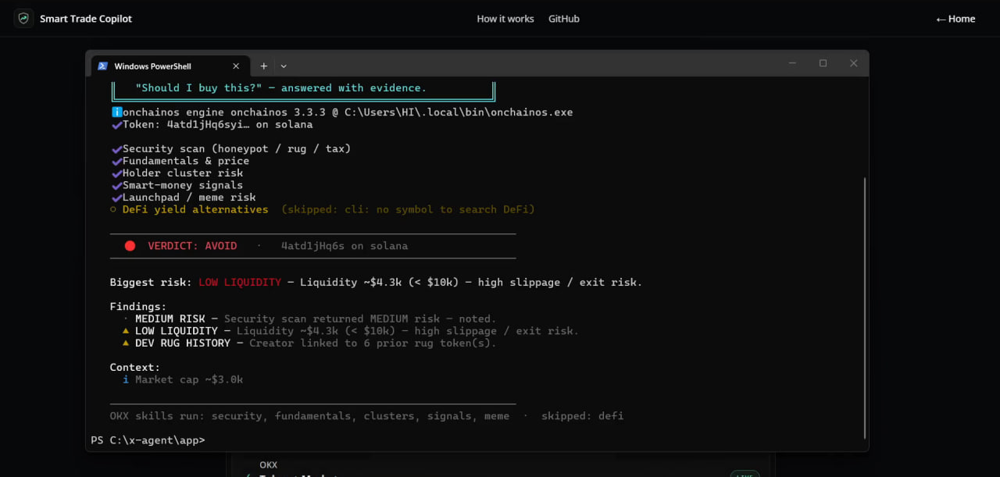
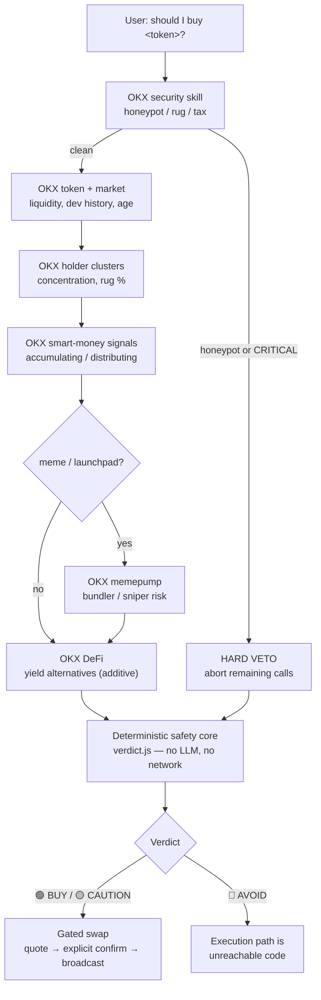
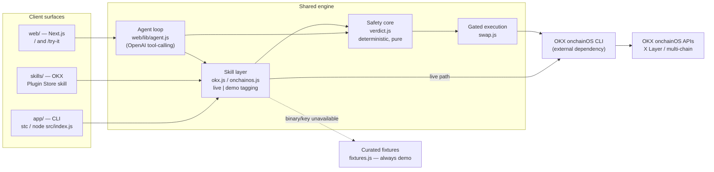
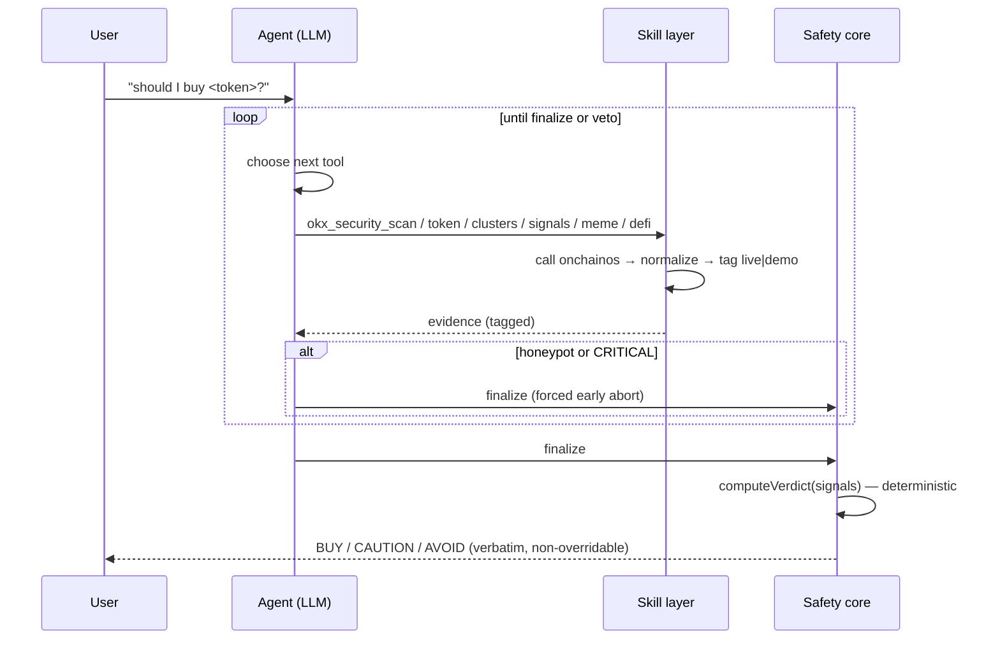
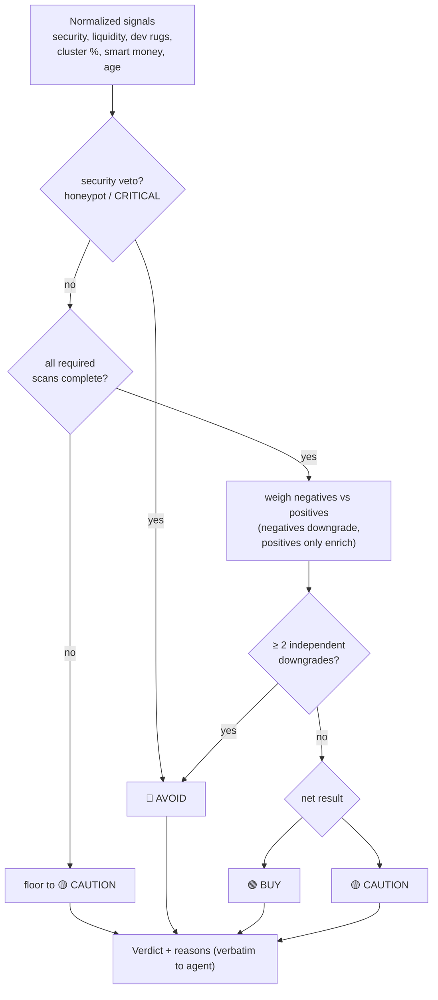
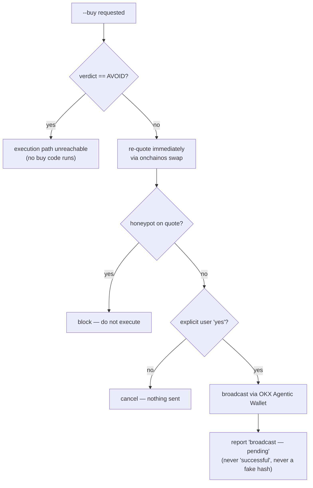

# Smart Trade Copilot

> An autonomous AI agent that decides for itself which OKX onchainOS skills to call to vet a token — then a fixed, unit-tested safety core the LLM **cannot override** delivers the final 🟢 BUY / 🟡 CAUTION / 🔴 AVOID ruling, and (only when it's safe) executes the swap.

<p>
  <strong>Build X-Agent Hackathon (OKX Web3) · Builder Track · X&nbsp;Layer</strong><br/>
  <em>Three surfaces — web app, CLI, OKX Plugin Store skill — one non-overridable engine.</em>
</p>

---

## 📹 Demo Video

<p align="center">
  <a href="https://youtu.be/NiOtU7SdL64" title="Watch the Smart Trade Copilot demo">
    
  </a>
</p>

<p align="center"><strong>▶ <a href="https://youtu.be/NiOtU7SdL64">Watch the demo on YouTube</a></strong></p>

**Live demo:** _<deploy URL — TBD>_

> The genuinely-live proof is the **local CLI** running against the real `onchainos`
> binary. A serverless host (e.g. Vercel) cannot ship that binary, so a hosted site
> serves clearly `demo`-tagged data with the same engine and UI. **Nothing is ever faked.**

---

## Table of contents

- [The thesis — why this is different](#the-thesis--why-this-is-different)
- [How it works](#how-it-works)
- [System architecture](#system-architecture)
- [The agent loop](#the-agent-loop)
- [The deterministic safety core](#the-deterministic-safety-core)
- [Gated execution](#gated-execution)
- [Three surfaces, one engine](#three-surfaces-one-engine)
- [Getting started](#getting-started)
- [Environment variables](#environment-variables)
- [Safety model](#safety-model)
- [Project structure](#project-structure)
- [License](#license)

---

## The thesis — why this is different

Most "AI trading agents" let the model decide everything — including whether your money
is safe. That is backwards. LLMs are excellent at *deciding what to investigate* and
unreliable as a *safety authority*.

Smart Trade Copilot splits those two responsibilities into structurally separate layers:

| Layer | Who decides | Property |
|---|---|---|
| **Investigation** | The LLM agent | Autonomous — picks which OKX skills to call, in what order, and aborts early on a security veto |
| **Judgement** | `verdict.js` | Deterministic, unit-tested, pure-function; the agent is **structurally forbidden from overriding it** |

The agent is genuinely agentic *and* the verdict is trustworthy — **because** an LLM
didn't make it. On `AVOID`, the execution path is unreachable code, not a prompt
guardrail. That separation is the whole product.

---

## How it works

Ask about any token. The agent orchestrates the OKX onchainOS skill suite as tools,
normalizes each response into the signals the safety core expects, and aborts the moment
security vetoes — never wasting calls on a token that's already disqualified.



**Decision rules enforced by the core:**

- **Security can hard-veto** — honeypot or `CRITICAL` → `AVOID`, full stop.
- **An incomplete scan is never a pass** — a scan that didn't complete floors the verdict to `CAUTION`.
- **Asymmetric weighting** — negatives downgrade; positives only enrich the explanation. Two independent downgrades collapse to `AVOID` even without an explicit veto.
- **Execution is earned** — a swap broadcasts only if the verdict permits *and* the user explicitly confirms. The agent never auto-confirms and never fabricates a tx hash.

---

## System architecture

Three client surfaces share one judgement engine. The agent decides *what to
investigate*; the deterministic core decides *the verdict*; the skill layer is the only
component that touches the network and it tags every datapoint `live` or `demo`.



**Component decomposition**

| Component | File(s) | Responsibility | Network | LLM |
|---|---|---|:---:|:---:|
| Agent loop | `web/lib/agent.js` | Chooses which skills to call, in what order; streams reasoning | indirect | ✅ |
| Skill layer | `web/lib/okx.js`, `app/src/onchainos.js`, `app/src/pipeline.js` | Calls the `onchainos` CLI, normalizes signals, tags `live`/`demo` | ✅ | ❌ |
| Safety core | `verdict.js` (web + app) | Computes `BUY`/`CAUTION`/`AVOID` from normalized signals | ❌ | ❌ |
| Gated execution | `app/src/swap.js`, swap path in `agent.js` | Re-quotes, confirms, broadcasts; unreachable on `AVOID` | ✅ | ❌ |
| Fixture fallback | `web/lib/fixtures.js`, `app/src/demo-data.js` | Honest `demo`-tagged data when live is unavailable | ❌ | ❌ |

---

## The agent loop

`web/lib/agent.js` runs a **real OpenAI tool-calling loop**. The OKX skills are
registered as tools and the model decides what to invoke and when to stop. The model
**cannot** decide the verdict — its only terminal action is `finalize`, which hands off
to the deterministic core.



**Model lifecycle & graceful degradation**

- Tools exposed: `okx_security_scan`, `okx_token_report`, `okx_holder_clusters`,
  `okx_smart_money`, `okx_meme_risk`, `okx_defi_alternatives`, `finalize`.
- Model is configurable via `STC_MODEL` (default `gpt-4o-mini`).
- **No `OPENAI_API_KEY`?** The web app does not fail or fake an agent — it falls back to
  an honest, non-LLM **deterministic sweep** and the UI explicitly states the agent
  layer is inactive. Degraded, but never dishonest.

---

## The deterministic safety core

`verdict.js` is a **pure function**: normalized signals in, a structured verdict out.
No network, no LLM, no I/O — which is exactly why it is unit-tested and trustworthy.



Run the core's unit tests with no network and no keys:

```bash
cd app && npm test    # node tests/verdict.test.mjs
```

---

## Gated execution

Execution is the only part that moves funds. It is **structurally** gated: on `AVOID`
the buy code is unreachable — the agent cannot route around its own safety core.



---

## Three surfaces, one engine

1. **`web/` — Next.js app.** Routes `/` (landing) and `/try-it` (live analyzer):
   type a token or paste a contract address, watch the agent reason live (streamed
   skill trace), get the verdict card and gated execution panel.
2. **`app/` — standalone CLI.** Same safety core, terminal-native, with a
   confirmation-gated real swap. Run via `node src/index.js …` or the `stc` bin.
3. **`skills/smart-trade-copilot/` — OKX Plugin Store skill.** The same disciplined
   pipeline packaged as an installable plugin (`plugin.yaml` + `skills/`).

---

## Getting started

### Prerequisites

- **Node.js >= 18.17**
- **The OKX `onchainos` CLI**, installed separately — it is an external dependency and
  is **not** in this repo. The wrappers look for it at `~/.local/bin/onchainos`
  (`onchainos.exe` on Windows) or via the `ONCHAINOS_BIN` env override.
  Install it from the [OKX Developer Portal](https://web3.okx.com/onchain-os/dev-portal).
- An OKX API key (set in a gitignored `.env`). The CLI also runs fully offline with `--demo`.
- For the agentic web layer: an `OPENAI_API_KEY` (optional — see degradation note above).

### CLI quickstart (`app/`)

```bash
cd app
npm install

# Fully LIVE — runs all 6 OKX onchainOS skills against the real CLI
node src/index.js analyze BONK --chain solana

# Offline sample run — no API key, no network  (equivalent: npm run demo)
node src/index.js --demo analyze BONK --chain solana

# By contract address, with gated, confirmation-required on-chain execution
node src/index.js analyze 0xabc… --chain base --buy 0.05 --pay eth

# Run the deterministic safety-core unit tests (no network, no keys)
npm test
```

Supported `--chain` values: `ethereum` (`eth`), `solana` (`sol`), `base`, `bsc`
(`bnb`), `polygon` (`matic`/`pol`), `arbitrum` (`arb`), `optimism` (`op`),
`avalanche` (`avax`), `xlayer`. A token can be a symbol or a contract address (`0x…`
or Solana base58 — auto-detected). Add `--meme` to force the launchpad/bundler scan
(auto-on for Solana). `--buy <amount>` requires `--pay <token>` and triggers the gated
flow: it quotes, requires you to type `yes`, and only then broadcasts. If the verdict
is `AVOID`, `--buy` exits without executing.

### Web app quickstart (`web/`)

```bash
cd web
npm install

# .env.local — set the agent key, or run the honest deterministic fallback
#   OPENAI_API_KEY=sk-...   (enables the real tool-calling agent)
#   STC_FORCE_DEMO=1        (forces demo fixtures; good for hosted demos)

npm run dev    # http://localhost:3000
```

- `/` — landing page (the thesis, how it works, CLI showcase).
- `/try-it` — live analyzer. Paste a real contract address for fully-live OKX
  onchainOS analysis, or load the `RUGPULL` scenario chip to see the safety core
  hard-veto and block execution.

---

## Environment variables

Create a gitignored `.env` (CLI, in `app/`) or `.env.local` (web, in `web/`).
**Never commit real secrets.**

```env
# OKX onchainOS credentials (used by the onchainos CLI)
OKX_API_KEY=
OKX_SECRET_KEY=
OKX_PASSPHRASE=

# Web agent layer — enables the real OpenAI tool-calling agent.
# If unset, the web app runs an honest non-LLM deterministic sweep.
OPENAI_API_KEY=

# Optional
STC_MODEL=gpt-4o-mini          # override the agent model (web)
STC_FORCE_DEMO=1               # force demo fixtures (hosted/serverless demos)
ONCHAINOS_BIN=                 # explicit path to the onchainos binary
```

---

## Safety model

- **Non-overridable core.** `verdict.js` is a deterministic, unit-tested pure function.
  The LLM is instructed it may not override, soften, or contradict the ruling and must
  present it verbatim. It is structurally separate from the agent.
- **Security hard-veto.** Honeypot or `CRITICAL` → `AVOID` immediately; the agent aborts
  further calls.
- **An incomplete scan is never a pass.** A scan that didn't complete floors the verdict
  to `CAUTION`.
- **Honesty tags.** Every datapoint is tagged `live` or `demo` in the UI and trace.
  Curated showcase scenarios are always `demo`-tagged. tx hashes are never faked.
- **Gated execution.** On `AVOID` the buy path is unreachable code. Execution always
  re-quotes first, requires an explicit user confirmation, blocks on honeypot-on-quote,
  and reports "broadcast — pending", never "successful".

---

## Project structure

```text
x-agent/
├── app/                         # Standalone CLI (Node, ESM)
│   ├── src/
│   │   ├── index.js             # CLI entrypoint, args, gated --buy flow
│   │   ├── pipeline.js          # Ordered OKX skill pipeline → normalized signals
│   │   ├── verdict.js           # Deterministic non-overridable safety core
│   │   ├── swap.js              # Confirmation-gated swap execution
│   │   ├── onchainos.js         # Defensive onchainos CLI wrapper
│   │   ├── ui.js / demo-data.js # Terminal UI + offline --demo data
│   └── tests/verdict.test.mjs   # Safety-core unit tests (npm test)
├── web/                         # Next.js app (landing + live analyzer)
│   ├── app/page.tsx             # Route /  (landing)
│   ├── app/try-it/page.tsx      # Route /try-it (live analyzer)
│   ├── app/api/analyze/route.js # Streaming analyze/buy endpoint
│   └── lib/
│       ├── agent.js             # OpenAI tool-calling agent + deterministic fallback
│       ├── okx.js               # OKX skill layer + live/demo fixture fallback
│       ├── verdict.js           # Same deterministic safety core
│       └── fixtures.js          # Curated demo scenarios (always demo-tagged)
└── skills/smart-trade-copilot/  # OKX Plugin Store skill (plugin.yaml + skills/)
```

---

## License

MIT © 2026 Victor Jayeoba ([github.com/victorjayeoba](https://github.com/victorjayeoba)).
See [`skills/smart-trade-copilot/LICENSE`](skills/smart-trade-copilot/LICENSE).
