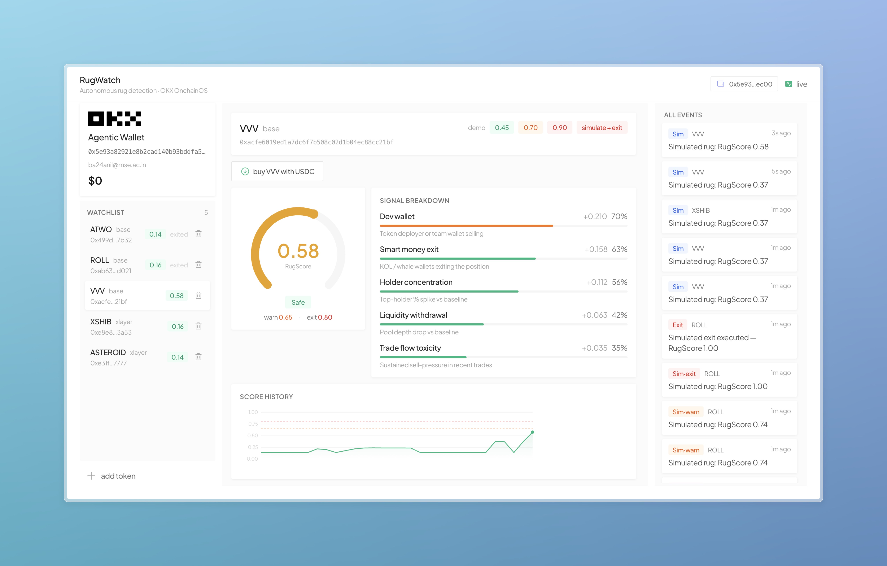

# RugWatch

Autonomous rug pull detection and exit agent built on **OKX OnchainOS**.

Monitors on-chain tokens for rug pull signals, computes a composite RugScore (0-1), and exits positions autonomously when the threshold is crossed. No human approval. No delay.

**Live:** https://rugwatch.sandpark.co
**Demo:** https://rugwatch.sandpark.co/demo (no wallet needed)



---

## how it works

```
token added → monitoring loop starts (every 60s)
                ↓
         fetch 5 signals in parallel
         - dev wallet movement      (weight 0.30)
         - smart money exit         (weight 0.25)
         - holder concentration     (weight 0.20)
         - liquidity withdrawal     (weight 0.15)
         - trade flow toxicity      (weight 0.10)
                ↓
         RugScore = Σ(signal × weight)
                ↓
         ≥ 0.65 → warning
         ≥ 0.80 → onchainos swap execute → USDC
```

All signal data comes from OKX OnchainOS. The exit routes across 500+ liquidity sources via the OKX DEX aggregator.

---

## stack

| layer | tech |
|---|---|
| backend | Python / FastAPI / asyncio / SQLite |
| frontend | Next.js 14 / Tailwind CSS |
| on-chain data | OKX OnchainOS (`onchainos` CLI) |
| exit execution | `onchainos swap execute` |
| agent wallet | OKX Agentic Wallet |
| chains | Base, X Layer, Solana |
| hosting | DigitalOcean VPS + nginx + PM2 |

---

## architecture

```
                        nginx (SSL termination)
                        ┌──────────────────────────┐
  https://rugwatch.     │  :443                     │
  sandpark.co      ────►│  /api/* → localhost:8000  │
                        │  /*     → localhost:3000  │
                        └──────────────────────────┘
                              │              │
                    ┌─────────┘              └─────────┐
                    ▼                                  ▼
           FastAPI backend                    Next.js frontend
           ┌──────────────────┐              ┌──────────────────┐
           │  uvicorn :8000   │              │  next start :3000│
           │  SQLite persist  │              │  SSR + static    │
           │  onchainos CLI   │              │  /demo (static)  │
           │  monitoring loop │              └──────────────────┘
           └──────────────────┘
```

---

## setup (local development)

### prerequisites

- `onchainos` CLI installed (`npx @xagt/agent-plugin@latest setup`)
- Python 3.12+
- Node.js 18+

### backend

```bash
cd backend
python -m venv .venv && source .venv/bin/activate
pip install -r requirements.txt
cp .env.example .env
uvicorn main:app --reload --port 8000
```

### frontend

```bash
cd frontend
npm install
npm run dev
```

Open http://localhost:3000

### demo page (no backend needed)

Open http://localhost:3000/demo

---

## deploy (VPS)

RugWatch runs on a single VPS with nginx as reverse proxy.

```bash
# on the server
apt install nginx python3-venv nodejs npm
npm install -g pm2
certbot --nginx -d your-domain.com

# sync code
rsync -az backend/ frontend/ server:/opt/rugwatch/

# backend
cd /opt/rugwatch/backend
python3 -m venv .venv && .venv/bin/pip install -r requirements.txt

# frontend
cd /opt/rugwatch/frontend
npm install && npx next build

# start both
pm2 start ecosystem.config.js
pm2 save && pm2 startup
```

---

## OKX Agentic Wallet

RugWatch connects to your **OKX Agentic Wallet** through the `onchainos` CLI.

1. Open the dashboard — click the wallet button in the nav bar
2. Enter your email → **send code** → paste OTP → **verify**
3. Connected state shows your EVM address and balance
4. **Add token** — auto-exit uses the connected wallet
5. Optional: **buy {symbol} with USDC** to open a position via `onchainos swap execute`
6. When RugScore >= exit threshold, the agent sells back to USDC autonomously

---

## demo (simulated rug)

The dashboard has demo controls on each monitored token:

1. Add any token address via the watchlist
2. Use the **0.45 / 0.70 / 0.90** buttons to step the RugScore up
3. Or hit **simulate rug** to inject all signals at 1.0
4. Watch the gauge, signal bars, event log, and chart update in real time
5. If a wallet is connected, the agent fires `onchainos swap execute` at >= 0.80

Or visit [/demo](https://rugwatch.sandpark.co/demo) for a self-contained walkthrough with no backend required.

---

## api

| endpoint | method | auth | description |
|---|---|---|---|
| `/api/status` | GET | - | all token states + global events |
| `/api/health` | GET | - | health check |
| `/api/events` | GET | - | SSE stream of real-time events |
| `/api/watch` | POST | wallet | add a token to monitoring |
| `/api/watch/:address` | DELETE | wallet | remove a token |
| `/api/simulate-rug` | POST | wallet | inject artificial signals |
| `/api/wallet/login` | POST | - | send OTP to email |
| `/api/wallet/verify` | POST | - | verify OTP, get session |
| `/api/wallet/status` | GET | - | wallet connection state |
| `/api/wallet/balance` | GET | wallet | portfolio balance |
| `/api/wallet/buy` | POST | wallet | buy token with USDC |
| `/api/kill-switch` | POST | wallet | toggle emergency kill switch |

---

## signal sources

| signal | weight | CLI command |
|---|---|---|
| dev wallet movement | 0.30 | `onchainos tracker activities --tracker-type multi_address` |
| smart money exit | 0.25 | `onchainos tracker activities --tracker-type smart_money` |
| holder concentration | 0.20 | `onchainos token cluster-overview` |
| liquidity withdrawal | 0.15 | `onchainos token liquidity` |
| trade flow toxicity | 0.10 | `onchainos token trades` |

---

## project structure

```
rugwatch/
├── backend/
│   ├── main.py            # FastAPI app + all routes
│   ├── monitor.py         # async monitoring loop per token
│   ├── signals.py         # 5 signal calculators (onchainos CLI)
│   ├── scorer.py          # weighted RugScore aggregation
│   ├── exit.py            # autonomous swap exit via onchainos
│   ├── state.py           # token state dataclasses
│   ├── app_state.py       # singleton state with async locks
│   ├── db.py              # SQLite persistence (aiosqlite)
│   ├── auth.py            # session auth middleware
│   ├── wallet.py          # OKX wallet integration
│   ├── config.py          # pydantic settings
│   └── requirements.txt
├── frontend/
│   ├── app/
│   │   ├── page.tsx       # main dashboard route
│   │   ├── dashboard.tsx  # dashboard client component
│   │   ├── demo/          # self-contained demo page
│   │   ├── layout.tsx     # root layout + fonts
│   │   └── globals.css    # design system
│   ├── components/
│   │   ├── RiskGauge.tsx      # SVG score gauge
│   │   ├── SignalPanel.tsx    # 5 signal bars
│   │   ├── ScoreChart.tsx     # score history sparkline
│   │   ├── WatchList.tsx      # token list sidebar
│   │   ├── WalletPanel.tsx    # wallet connection card
│   │   ├── EventLog.tsx       # real-time event feed
│   │   ├── BuyPosition.tsx    # buy token form
│   │   ├── AddTokenForm.tsx   # add token to watchlist
│   │   └── ErrorBoundary.tsx  # error boundary wrapper
│   └── lib/
│       ├── types.ts       # TypeScript types
│       ├── api.ts         # API client + session management
│       └── demo-data.ts   # demo page mock data
└── ecosystem.config.js    # PM2 process config
```

---

## license

MIT
